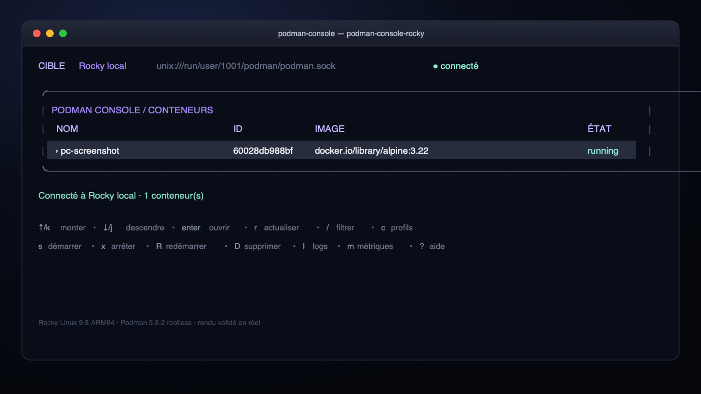
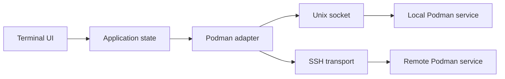

<div align="center">

# Podman Console

**A focused terminal UI for operating local and remote Podman hosts.**

[](https://github.com/Opperiesen/podman-console/actions/workflows/ci.yml)
[](LICENSE)
[](go.mod)

Inspect containers, read live logs, watch resource usage, and perform guarded lifecycle
operations without leaving your terminal.

</div>



_Live validation on Rocky Linux 9.8 ARM64 with rootless Podman 5.8.2._

## Why Podman Console?

Podman already provides excellent command-line tools. Podman Console adds a persistent, keyboard-
driven view for the moments when repeated inspection and careful operations are easier to manage
visually:

- one consistent inventory for a local socket or a remote Podman service;
- container details with explicit empty states for ports, mounts, and networks;
- confirmation prompts that name the target before stop, restart, or removal;
- ordered logs with optional follow mode;
- CPU and memory samples that remain visible when a stream disconnects;
- no daemon, database, password store, or private key handling in the application.

## Feature overview

| Area | What is included |
| --- | --- |
| Connections | Local Unix sockets and remote Podman sockets over SSH |
| Inventory | Names, short IDs, images, and container states |
| Details | Identifiers, image, state, ports, mounts, and networks |
| Lifecycle | Start, stop, restart, and exact-ID removal with confirmation |
| Observability | Ordered logs, follow mode, CPU samples, and memory usage |
| Interface | Keyboard-first TUI built with Bubble Tea and Lip Gloss |

## Architecture



The application targets one Podman host at a time. The adapter keeps transport details behind a
small interface, which lets the TUI use the same inventory, lifecycle, log, and metrics flows for
local and remote services.

## Quick start

### Requirements

- Go 1.26.7 or newer;
- a UTF-8 terminal;
- an optional reachable Podman service for live use.

Build and run the application from the repository root:

```sh
go build -tags=containers_image_openpgp,remote -o podman-console ./cmd/podman-console
./podman-console
```

The build tags select the pure-Go OpenPGP backend and the remote Podman service mode. No native
`gpgme` installation is required.

The application starts without a live Podman host. Create a profile from the UI, or use a URI such
as:

```text
unix:///run/user/1000/podman/podman.sock
ssh://user@example.test/run/user/1000/podman/podman.sock
```

For the complete acceptance workflow, including the disposable live-container test, see the
[MVP quickstart](specs/001-podman-console-mvp/quickstart.md).

## Keyboard workflow

| Key | Action |
| --- | --- |
| `↑` / `k`, `↓` / `j` | Move through containers |
| `Enter` | Open details |
| `r` | Refresh |
| `/` | Filter |
| `c` | Manage connection profiles |
| `s` / `x` / `R` / `D` | Start / stop / restart / remove |
| `l` / `m` | Logs / metrics |
| `?` | Help |

More interaction details are documented in [keybindings](docs/keybindings.md) and
[connection profiles](docs/connections.md).

## Development

Run the same checks used by CI:

```sh
go test -tags=containers_image_openpgp,remote ./...
go vet -tags=containers_image_openpgp,remote ./...
go build -tags=containers_image_openpgp,remote ./cmd/podman-console
```

The default test suite does not require Podman. Live integration tests are opt-in and require
`PODMAN_CONSOLE_URI`. SSH validation additionally uses `PODMAN_CONSOLE_IDENTITY`; the full
workflow can be enabled with `PODMAN_CONSOLE_TEST_CONTAINER`, which identifies the disposable
container to inspect and remove.

```sh
PODMAN_CONSOLE_URI='ssh://user@host/run/user/1000/podman/podman.sock' \
PODMAN_CONSOLE_IDENTITY='/path/to/identity' \
PODMAN_CONSOLE_TEST_CONTAINER='podman-console-live-test' \
go test -tags=containers_image_openpgp,remote,integration -v ./tests/integration
```

CI validates tests, vet, version metadata, and cross-platform builds for Darwin, Linux, and
Windows on amd64 and arm64.

## Scope

The current MVP focuses on one active Podman target and its containers. Bulk operations, image
building, registries, pod orchestration, and multi-host aggregation are intentionally outside the
current scope.

## Contributing

Contributions are welcome. The project is deliberately small, so changes that improve clarity,
reliability, accessibility, documentation, or live-host compatibility are especially useful.

1. Open an issue for a substantial change so the approach can be discussed early.
2. Keep pull requests focused and explain the user-facing behavior they change.
3. Add or update tests for behavior changes.
4. Run the formatting, test, vet, and build commands above before submitting.
5. Include live-environment details when reporting a Podman transport or compatibility issue.

## License

Podman Console is released under the [Apache License 2.0](LICENSE). Contributions are accepted
under the same terms.
